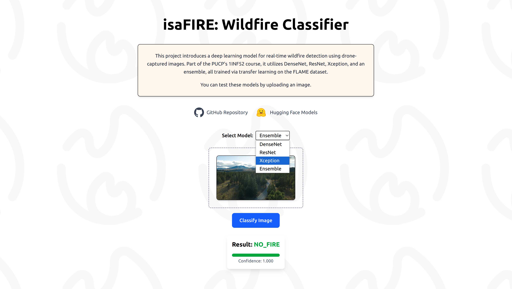

# Wildfire Classifier - 1INF52 Project

<h1 align="center">

</h1>

Minimal application for testing trained deep learning models that classify images as *fire* or *no fire*. Built as a demonstration app for the [isaFIRE](https://github.com/superflash41/isaFIRE) project.

## Set up

1. Set up the backend:

```bash
cd isaFIRE/back
python -m venv .venv
source .venv/bin/activate
pip install -r requirements.txt
```

2. Configure the paths of the models in the `.env` file and run the FastAPI server:

```bash
uvicorn app.main:app --reload --port 8000
```

3. Set up the frontend:

```bash
cd front
bun install
```

4. Configure the API URL in an `.env` file and run the app:

```bash
bun run dev
```

## Usage

1. Choose a model from the dropdown (DenseNet, ResNet, Xception, or Ensemble).
3. Upload an image (jpg/png).
4. Click *Classify Image*.
5. View the classification label and confidence.

## Models

Trained models can be found on [Hugging Face](https://huggingface.co/superflash41/fire-chad-detector-v1.0).

## Acknowledgements

This project was developed by Saymon Nicho, Patricia Cántaro and Carlos Zegarra.